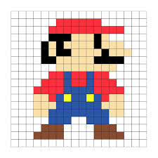
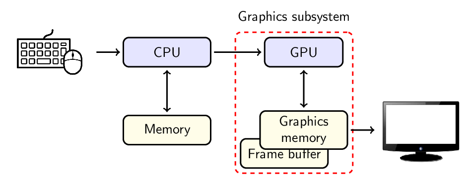
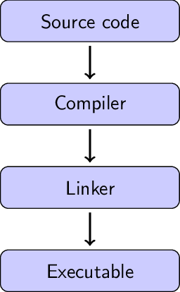

# Module Information

- 15 credit level 5 unit
  
- 1 lecture (1 hour) and 1 lab (2 hours) per week -- total student effort 1500 hours
  
- 1 coursework assignment worth 100% -- due **Friday 16th May 2025** (released week 2)

**Learning Outcomes**

1. Select and use appropriate mathematical tools for constructing and
manipulating geometry in 3D space

1. Develop an interactive 3D graphics application using an
industry-standard API

1. Write shader code for the programmable pipeline on modern graphics
hardware using an industry standard shader language

# About me

<style>
.container{
    display: flex;
}
.col{
    flex: 1;
}
</style>

<div class="container">

<div class="col">
- Dr Jon Shiach
  
- Email: [j.shiach@mmu.ac.uk](mailto:j.shiach@mmu.ac.uk)
  
- Office: DB 3.27

- Office hours: TBC (see Moodle)
</div>

<div class="col">
<center>
    
</center>
</div>

</div>

# Teaching Schedule

| Week | Date (Monday) | Content |
|:--:|:--:|:--|
| 1  | 27/01/25 | Introduction to module |
| 2  | 03/02/25 | Basic shapes in OpenGL |
| 3  | 10/02/25 | Textures               |
| 4  | 17/02/25 | Vectors and matrices   |
| 5  | 24/02/25 | Transformations        |
| 6  | 03/03/25 | 3D Worlds              |
| 7  | 10/03/25 | Moving the camera      |
| 8  | 17/03/25 | Lighting               |
| 9  | 24/03/25 | Normal mapping         |
| 10 | 31/03/25 | Quaternions            |
| 11 | 07/04/25 | Consolidation and round-up |

# Super Mario Bros - 1985

<center>
    
</center>

- Just 40 KB
- Clever use of repeated sprites

## Elite -- 1984

<center>
    
</center>

- Early 3D graphics

## Doom -- 1993

<center>
    
</center>

- Pseudo 3D first-person shooter
- First use of tree data structures to deal with hidden surface removal

## Quake -- 1996

<center>
    
</center>

- First fully 3D first-person shooter

## Tomb Raider -- 1996

<center>
    
</center>

- First use of quaternions to allow for third-person camera view

## The Last of Us Part II -- 2020

<center>
    
</center>

- Use of motion capture for character animations (not the first game to do this, just my favourite)

# Definitions

<style>
.container{
    display: flex;
}
.col{
    flex: 1;
}
</style>

<div class="container">

<div class="col">
- **Pixel** -- a single indivisible square that are combined to form an image on a display
  
- **Raster** -- a grid of pixels
  
- **Fragment** -- a section of a raster
  
- **Buffer** -- a region of memory used to store data
  
- **Frame** -- a single image shown on a display
  
- **Frame buffer** -- the memory required to store a frame
  
- **Refresh rate** -- number of times per second the display shows another frame
</div>

<div class="col">
<center>
    
</center>
</div>

</div>

# RGB Colour Model

- Different levels of the three primary colours Red, Green and Blue provide colours

- 3-bit colour (1 bit of each primary colour) produces $2^1 \times 2^1 \times 2^1 = 8$ different colours

| Red | Green | Blue | Colour |
|:---:|:-----:|:----:|:-------|:--:|
| 0   | 0     | 0    | Black | <span style="color:rgb(0,0,0)">&#9724;</span>|
| 0   | 0     | 1    | Blue | <span style="color:rgb(0,0,255)">&#9724;</span> |
| 0   | 1     | 0    | Green | <span style="color:rgb(0,255,0)">&#9724;</span>  |
| 0   | 1     | 1    | Cyan | <span style="color:rgb(0,255,255)">&#9724;</span> |
| 1   | 0     | 0    | Red | <span style="color:rgb(255,0,0)">&#9724;</span>  |
| 1   | 0     | 1    | Magenta | <span style="color:rgb(255,0,255)">&#9724;</span>|
| 1   | 1     | 0    | Yellow | <span style="color:rgb(255,255,0)">&#9724;</span> |
| 1   | 1     | 1    | White | <span style="color:rgb(255,255,255)">&#9724;</span> |

# 24-bit colour

- 24-bit colour, 8 bits of each primary colours produces $2^8 \times 2^8 \times 2^8 = 16,777,216$ different colours

- The human eye can detect approximately 10 million colours so 24-bit colour is good enough (known as *True colour*)

- The size of a **frame buffer** for a $1920 \times 1080$ raster using a colour depth of 32 bits per pixel (24-bits for colour, 8-bits for opacity) is

\begin{align*}
    \text{frame buffer size} &= \text{width} \times \text{height} \times \text{bits per pixel} \\
    &= 1920 \times 1080 \times 32 \text{ bits} \\
    &= 66,355,200 \text{ bits} \\
    &= 8.3 \text{ MB}
\end{align*}

- So everytime the display is refreshed we need to transfer 8.3MB of data

# 3D Graphics

- 3D graphics are defined using geometric co-ordinates $(x, y, z)$

- To display 3D graphics on a 2D display we need to do:
  - determine the position of a virtual camera (usually using keyboard and mouse inputs)
  
  - determine the co-ordinates of the objects in the 3D space relative to the camera
  
  - project the 3D co-ordinates onto a 2D plane taking into account depth perspective
  
  - determine the colours of the fragments that make up each 3D object and send this information to the display

- All calculations and data transfer must be done within a required refresh rate -- usually 30 or 60 fps

# Hardware

<center>
    
</center>


# Graphics API

- A **graphics API** is a set of tools, functions and procedures that allow us to interact with our graphics hardware

- Some popular graphics APIs are:
  - **OpenGL** -- a cross-platform graphics API originally developed by Silicon Graphics in the early 1990s (then called Iris GL), it is now open source and maintained by the Khronos Group
  
  - **Vulkan** --  developed by the Khronos group to be a successor to OpenGL. Released in 2016 Vulkan is a low level API meaning much of the memory management is left to the developer
  
  - **DirectX** -- developed by Microsoft (hence the Xbox) in the early 1990s and maintained to this day with Direct3D 12. Limited to Windows and Xbox
  
  - **Metal** -- developed by Apple and limited to macOS, iOS and iPadOS

- We will be using OpenGL as it's the industry standard cross-platform and there is lots of guidance material available

# Why C++? 

- We need a language that is:

  - mature and well established

  - fast at performing calculations, accessing system devices, manipulating memory

  - supported by the graphics API

- C++ is the obvious choice

  - Originally created to write operating systems so all device drivers and OS resources are written in it

  - Platform independent - same code will work on Windows, macOS and Linux

  - Object orientated - easy to import and use libraries

# How C++ Works

<style>
.container{
    display: flex;
}
.col{
    flex: 1;
}
</style>

<div class="container">

<div class="col">

- **Source code** -- C++ files (.cpp) and header files (.hpp) written by the programmer
  
- **Compiler** -- converts C++ code into machine code

- **Linker** -- links compiled C++ code to external resources

- **Executable** -- an application (executable program) or library (reusable resource)

- Compiler and linker are specific to each hardware platform.
</div>

<div class="col">
<center>
    
</center>
</div>

</div>

# C++ Variables

| Type | Description |
|:-----|:------------|
| `int` | integer, e.g., `1`, `-2`, `0` |
| `unsigned int` | positive integers only, e.g., `1`, `2`, `3` |
| `float` | floating point numbers, e.g., `1.23f` |
| `double` | double floating point
| `char` | single character, e.g., `a` |
| `string` | text consisting of multiple characters, e.g., `hello world` |
| `bool` | Boolean values, e.g., `true` or `false` |

# Operators

| Operator | Description | Example |
|:--|:--|:--|
| `=` | Assignment operator | `a = 5;` |
| `+`, `-`, `*`, `/` | Standard arithmetic operators | `b = 2 * a;` |
| `%` | Modulo (remainder) | `x % 2;` |
| `+=`, `-=`, `*=`, `/=` | Compound operators | `a *= 2;` |
| `++`, `--` | Indcrement and decrement | `a++;` |
| `==`, `!=` | Logical equals/not equals | `a != 2;` |
| `<`, `>`, `>=`, `<=` | Greater/less than | `a <= 2;` |
| `&&`, `||` | Logical and/or | `a == 2 && y > 4;` |


# Hello World

```cpp
#include <iostream>

int main() 
{
    std::cout << "hello world" << std::endl;
    return 0;
}
```

- All C++ programs need a `main()` function

- All C++ functions need an output specifier, e.g., `int`, `float`, `void` etc

- All C++ expressions must end with a semi-colon `;`

- `iostream` -- standard input/output library
  - `std::cout` -- standard output stream
  - `<<` -- insertion operator
  - `std::endl` -- new line and flushes output stream

# If-Else

```cpp
if (condition1) 
{
    // code to be executed if condition1 is true
} 
else if (condition2) 
{
    // code to be executed if condition1 is false and condition2 is true
} 
else
{
    // code to be executed if both condition1 and condition2 are false
}
```

Curly braces are not needed for single line code within an if statement, e.g.,

```cpp
if (condition)
    // single line to be executed if condition is true
```

# For Loops

```cpp
for (before statement ; condition ; after statement) 
{
    // block of code to be executed
}
```

- `before statement` -- declare an initial value for a loop variable, e.g., `i`
  
- `condition` -- the condition that when true the loop terminates
  
- `after statement` -- what happens to the loop variable after each iteration

```cpp
for (int i = 0; i < 10; i++)
    std::cout << i << std::endl;
```

Will print out the numbers 0 to 9

# While Loops

```cpp
while ( condition )
{
    // block of code to be executed
}
```

```cpp
do {
    // block of code to be executed
}
while ( condition ) ;
```

- While loops are used for when we don't know when the loop will be terminated beforehand

# Arrays

```cpp
// Array of integers
int array[] = {1 , 2 , 3 , 4};

// Array of floats
float floatArray[] = {1.0 f , 2.0 f , 3.0 f , 4.0 f };

// Indexing arrays
int firstElement = array[0];

// Memory used for array
unsigned int memory = sizeof(array) ;
```

- Array elements are stored in contiguous memory locations

- Array indexing starts at 0

- `sizeof(array)` returns the number of bits used to store an array

- The number of elements in an array can be calculated using `sizeof(array) / sizeof(<type>)`

# The Labs

- You will be doing practical hands on stuff in the lab sessions

- The lab materials are avaialble online at [https://jonshiach.github.io/graphics-notes](https://jonshiach.github.io/graphics-notes){target="_blank"} (see Moodle)

- Download the template files from GitHub

- Each lab is a code along where you will be exposed to various techniques and have they are implemented in your program

- The labs use code from previous labs, so you will need to make sure you are up-to-date

- It's not a race, work at your own pace and help each other

# Any Questions?