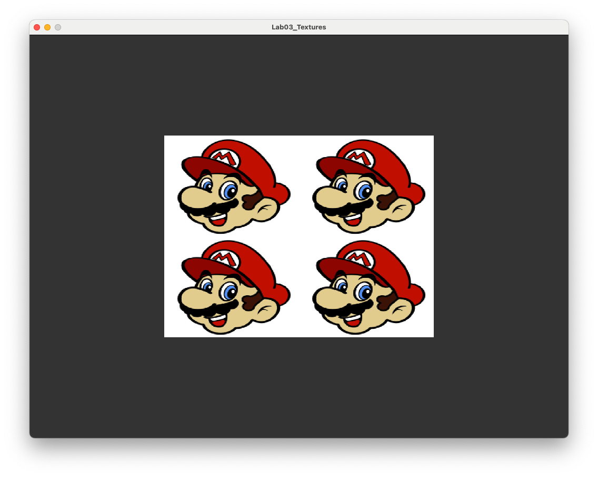
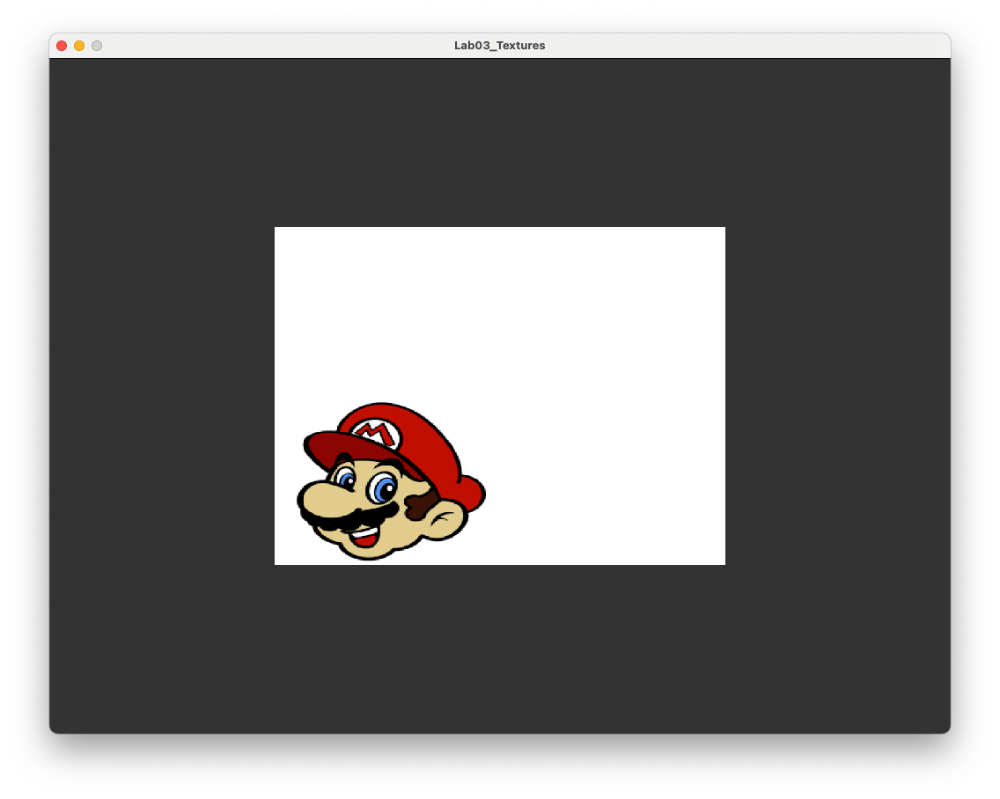
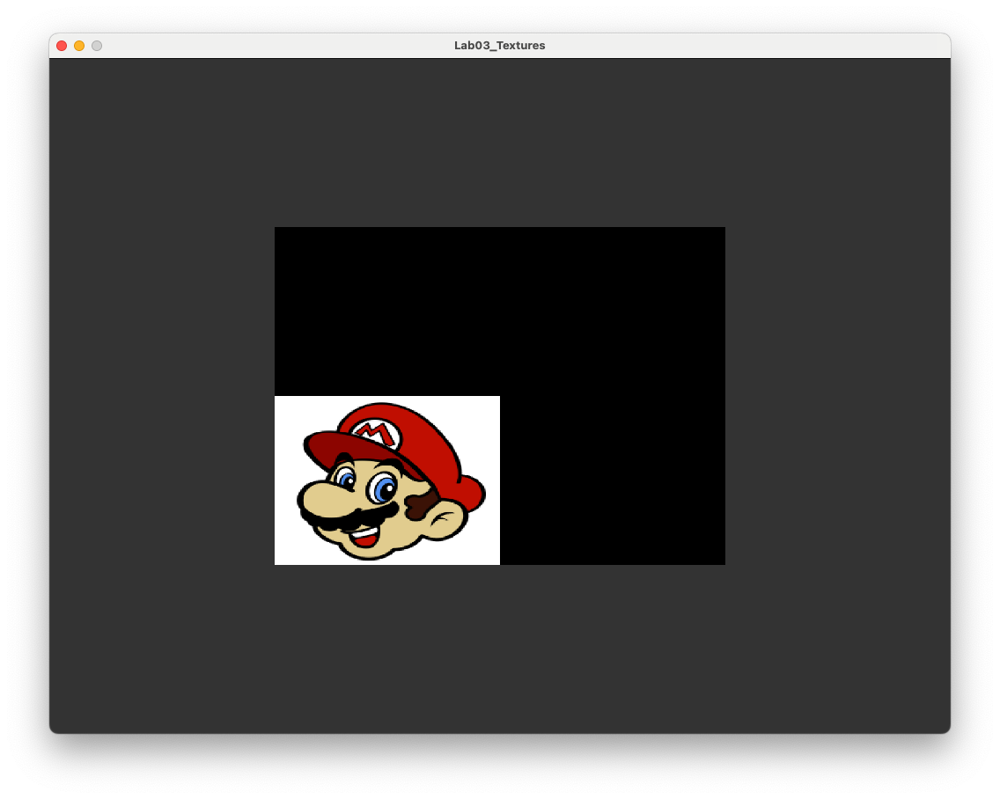

# Textures

A **texture** is a 2D image applied to a surface of an object to give colour, detail and visual complexity

The process of applying a texture to an object is called **texture mapping**

Textures are typically stored as image files, e.g., BMP (BitMap), JPEG (Joint Photographic Experts Group), PNG (Portable Network Graphics), DDS (Direct Draw Surface)

# Texture Co-ordinates

<center>
    
</center>

A **textel** is an individual pixel in a texture is referenced by its **texture coordinates** $(u, v)$ that are in the range 0 to 1

For each vertex of an object with co-ordinates $(x, y)$, we specify the corresponding texture co-ordinates $(u,v)$

For each fragment of the object, OpenGL calculates the corresponding texture co-ordinates of the textels by interpolation and the colour of the textel is used for the colour of the fragment

# Creating a Texture

We need to create an OpenGL texture in our C++ program

```cpp
unsigned int texture;
glGenTextures(1, &texture);
glBindTexture(GL_TEXTURE_2D, texture);
```

- `texture` ---  an integer value used to refer to the texture
  
- `glGenTextures` --- generates an OpenGL texture

- `glBindTexture` --- binds the texture integer to a 2D OpenGL texture

# Load Texture Map

The texture map is loaded from an external image file

```cpp
const char *path = "../assets/crate.jpeg";
int width, height, nChannels;
stbi_set_flip_vertically_on_load(true);
unsigned char *data = stbi_load(path, &width, &height, &nChannels, 0);
```

- `path` --- a string containing the path and filename of the texture file
  
- `width`, `height`, `nChannels` --- the dimensions of the texture and number of colour channels (e.g., 3 for RGB)
  
- `stbi_set_flip_vertically_on_load(true)` --- flips the texture vertically (so the origin is the bottom-left corner instead of the top-left corner)
  
- `stbi_load()` --- a function from the [stb_image](https://github.com/nothings/stb/tree/master){target="_blank"} library that loads an image file and stores the data in `data`

# The Crate Texture

<center>
    
</center>

# Tell OpenGL about the texture

```cpp
glTexImage2D(GL_TEXTURE_2D, 0, GL_RGB, width, height, 0, GL_RGB,
                GL_UNSIGNED_BYTE, data);
glGenerateMipmap(GL_TEXTURE_2D);
```

- `glTexImage2D()` --- gives OpenGL the information about our texture

- `glGenerateMipmaps()` --- generates the mipmaps for the texture (see later)

# Define the Texture Co-ordinates

For each of the vertex co-ordinates of our triangle we need a buffer to store the $(u,v)$ texture co-ordinates

```cpp
const float uv[] = {
    // u   v
    0.0f, 0.0f,
    1.0f, 0.0f,
    0.5f, 1.0f
};
```

Here were are defining the following mapping

| Vertex | Vertex co-ordinates $(x,y,z)$ | Texture co-ordinates $(u,v)$ |
|:--|:--:|:--:|
| Bottom-left | $(-0.5, -0.5, 0)$ | $(0,0)$ |
| Bottom-right | $(0.5, -0.5, 0)$ | $(1,0)$ |
| Top | $(0, 0.5, 0)$ | $(0.5, 1)$ |

# Texture Buffer

When we drew our triangle last week we used a Vertex Buffer Object (VBO) to store the vertex co-ordinates, we need to do similar for the texture co-ordinates.

First create the texture buffer (similar to the VBO)

```cpp
unsigned int uvBuffer;
glGenBuffers(1, &uvBuffer);
glBindBuffer(GL_ARRAY_BUFFER, uvBuffer);
glBufferData(GL_ARRAY_BUFFER, sizeof(uv), uv, GL_STATIC_DRAW);
```

Then tell OpenGL where to find it

```cpp
glEnableVertexAttribArray(1);
glBindBuffer(GL_ARRAY_BUFFER, uvBuffer);
glVertexAttribPointer(1, 2, GL_FLOAT, GL_FALSE, 0, (void*)0);
```

See last week's slides, or the lab sheets, for an explanation of these functions

# Vertex Shader

We need to make changes to the vertex shader to pass the texture co-ordinates to the fragment shader.

```cpp
#version 330 core

layout(location = 0) in vec3 position;
layout(location = 1) in vec2 texCoord;

out vec2 texCoord;

void main()
{
    // Output vertex position
    gl_Position = vec4(position, 1.0);
    
    // Output texture co-ordinates
    uv = texCoord;
}
```

Note that the texture co-ordinates are inputted as a `vec2` object from `location=1` which was specified using the `glVertexAttribPointer()` function on the previous slide

# Fragment Shader

We also need to change the fragment shader so that it retrieves the fragment colour from the texture

```cpp
#version 330 core

in vec2 texCoord;

out vec3 colour;

uniform sampler2D textureMap;

void main()
{
    colour = vec3(texture(textureMap, uv));
}
```

The input `uv` is the interpolated texture co-ordinate for the current fragment

We have also used a **uniform** to pass the texture into the fragment shader (more on this in a bit)

# Texture Triangle

<center>
    
</center>

# Texture Rectangle

A rectangle object can be constructed using two triangles

<center>
    
</center>

# Texture Rectangle Co-ordinates

```cpp
// Define vertex positions
static const float vertices[] = {
    -0.5f, -0.5f, 0.0f,    // triangle 1
     0.5f, -0.5f, 0.0f,
     0.5f,  0.5f, 0.0f,
    -0.5f, -0.5f, 0.0f,    // triangle 2
     0.5f,  0.5f, 0.0f,
    -0.5f,  0.5f, 0.0f
};

// Define texture co-ordinates
static const float uv[] = {
    // u    v
    0.0f,  0.0f,    // triangle 1
    1.0f,  0.0f,
    1.0f,  1.0f,
    0.0f,  0.0f,    // triangle 2
    1.0f,  1.0f,
    0.0f,  1.0f
};
```

# Texture Rectangle Result

<center>
    
</center>

# Indexing Vertex Co-ordinates

Our rectangle is defined using six sets of co-ordinates but two of the co-ordinates are the same

To avoid duplication we can define the four vertices of a rectangle and use indexing to link the vertices of the triangle to the list

```cpp
// Define vertex positions
static const float vertices[] = {
    // x     y     z      index
    -0.5f, -0.5f, 0.0f,  // 0       3 -- 2
     0.5f, -0.5f, 0.0f,  // 1       |  / |  
     0.5f,  0.5f, 0.0f,  // 2       | /  |
    -0.5f,  0.5f, 0.0f   // 3       0 -- 1
};

// Define texture co-ordinates
static const float uv[] = {
    // u    v      index
    0.0f,  0.0f,  // 0
    1.0f,  0.0f,  // 1
    1.0f,  1.0f,  // 2
    0.0f,  1.0f,  // 3
};

// Define indices
static const unsigned int indices[] = {
    0, 1, 2,  // lower-right triangle
    0, 2, 3   // upper-left triangle
};
```

# Element Buffer Object

The indices that link the triangle vertices to the co-ordinate list are stored in an **Element Buffer Object (EBO)** which are created in the same way as the VBO

```cpp
// Create Element Buffer Object (EBO)
unsigned int EBO;
glGenBuffers(1, &EBO);
glBindBuffer(GL_ELEMENT_ARRAY_BUFFER, EBO);
glBufferData(GL_ELEMENT_ARRAY_BUFFER, sizeof(indices), indices, GL_STATIC_DRAW);
```

We also need to tell OpenGL that we have an EBO so we change the drawing function 

```cpp
glDrawElements(GL_TRIANGLES, sizeof(indices) / sizeof(unsigned int), GL_UNSIGNED_INT, 0);
```

This now draws the same rectangle as before but avoids duplication of vertices

# Texture Wrapping

When the texture co-ordinates fall outside of the range 0 to 1 OpenGL applies **texture wrapping**

For example if we use 2 instead of 1 in the texture co-ordinates for the two triangles

<center>
    
</center>

Here OpenGL has 'wrapped' the texture to fill the rectangle

# Texture Wrapping Types

OpenGL offers other options for texture wrapping;

- `GL_REPEAT` --- the texture repeats over the fragment (default)
  
- `GL_MIRRORED_REPEAT` --- same as `GL_REPEAT` but the texture is mirrored with each repeat
  
- `GL_CLAMP_TO_EDGE` --- clamps the texture co-ordinates to between 0 and 1, co-ordinates outside of this range are clamped to the edge so that the textels on the edge are stretched to the edge of the fragment
  
- `GL_CLAMP_TO_BORDER` --- co-ordinates outside of the range $(0,0)$ to $(1,1)$ are given a used defined border colour

We can specify the texture wrapping using the `glTexParameteri()` function. To apply `GL_MIRRORED_REPEAT` add the following code after the texture as been specified.

# `GL_REPEAT`

<center>
    
</center>

# `GL_MIRRORED_REPEAT`

<center>
    
</center>

# `GL_CLAMP_TO_EDGE`

<center>
    
</center>

# `GL_CLAMP_TO_BORDER`

<center>
    
</center>